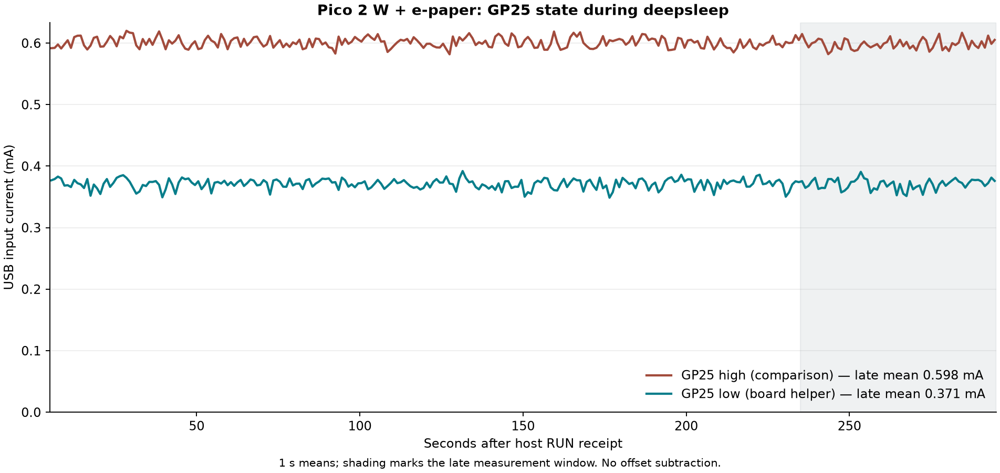

# Pico 2 W s e-paperem: další úspora přes GP25, 27. 9. 2026

**S připojeným displejem klesl naměřený USB odběr z 0,5983 na 0,3708 mA**, tedy
o dalších **38,0 %** proti již optimalizovaným pinům panelu. Oba srovnávací
spánky trvaly 300 s. Pomohlo stáhnout GP25/WL_CS do nuly po úplném vypnutí
rádia. Firmware a fyzické zapojení zůstaly stejné.

Navazuje na [optimalizaci pinů displeje](POWER-OPT-MAC-20260927.md), jejíž
helper se používá ve všech nových variantách. Proti tamnímu výchozímu
300s běhu 3,8195 mA je nový výsledek přibližně o 90,3 % nižší. Toto poslední
procento spojuje dvě navazující měření; přímé nové A/B srovnání je níže.
Jde o USB vstup celé sestavy s uspaným panelem a vypnutým rádiem, nikoli
spotřebu samotného RP2350 nebo průměr úplného aplikačního cyklu.

## Dvě stejně dlouhá měření

Stejné pevné okno 235–295 s od přijetí události RUN hostitelem, po 6 000
vzorcích. Hodnoty nejsou korigované o nezatíženou referenci měřáku.

| Příprava před 300s deepsleep | Proud | Příkon | Výsledek |
| --- | ---: | ---: | --- |
| Rádio off, panel sleep + Hi-Z, GP25 HIGH | 0,59832 mA | 3,04145 mW | PASS |
| Totéž, GP25 LOW přes přesný veřejný helper | 0,37077 mA | 1,88489 mW | PASS |

Rozdíl je **0,22755 mA / 38,03 %**. V optimalizovaném pozdním okně měly
jednotlivé vzorky rozsah 0,34–0,40 mA a 5.–95. percentil 0,35–0,38 mA.
Napětí USB bylo v průměru 5,08332 a 5,08369 V. Výsledek platí pro tento kus,
zapojení a běhy; není zárukou odběru všech desek.

Před dlouhým měřením proběhl krátký vratný test HIGH → LOW → HIGH, vždy
45 s a okno 5–40 s s 3 500 vzorky:

| GP25 | Proud | Výsledek |
| --- | ---: | --- |
| HIGH, první kontrola | 0,60074 mA | PASS |
| LOW | 0,37168 mA | PASS |
| HIGH, opakovaná kontrola | 0,60173 mA | PASS |

Návrat původního odběru podporuje přičtení úspory změně GP25. Stav ostatních
sledovaných pinů, panelových padů a řídicí nastavení USB zůstaly při přípravě
stejné. Okamžité read-only stavy přijímače USB se mezi záznamy lišily.
Změna se projevila v krátkém i pozdním okně dlouhého běhu.

## Proč GP25 pomáhá

[Oficiální samostatné schéma Pico 2 W, revize 2](https://datasheets.raspberrypi.com/picow/pico-2-w-schematic.pdf)
ukazuje cestu VSYS → R5 (20 kΩ) → Q1 → GP29/WL_CLK, s R6 (10 kΩ) k zemi.
Gate Q1 řídí GP25/WL_CS. Při GP25 LOW se tato měřicí cesta VSYS vypne;
hlavní napájení VSYS a napájení displeje se tím nevypínají.

Nové záznamy obsahují skutečné IO_BANK0 CTRL/STATUS, nejen SIO output-enable.
Po vypnutí rádia měl GP29 `CTRL=8` a `STATUS=0x2000`: mux PIO2, aktivní
výstup LOW. Proto zde nejde o jednoduchý nezatížený dělič 20 + 10 kΩ.
Naměřená úspora je slučitelná s odstraněním proudu přes R5/Q1 do tohoto
výstupu. Proud jednotlivých součástek a analogová napětí uzlů se samostatně
neměřily; GP25 současně řídí CS vypnutého CYW43, takže přesnou příčinu všech
mikroampérů nelze z A/B testu samotného rozdělit.

## Použití ověřených helperů

Nový [pico2w_vsys_lowpower.py](pico2w_vsys_lowpower.py) poskytuje
`radio_off_and_disable_vsys_monitor()`:

1. Ověří přesný typ Pico 2 W / RP2350.
2. Deaktivuje STA/AP a úplně deinitializuje CYW43.
3. Ověří GP23/WL_REG_ON jako skutečný SIO výstup LOW.
4. Nastaví GP25 jako výstup LOW bez pullů a znovu ověří oba piny včetně
   muxu, skutečného výstupu na pad, izolace a SIO latch/output-enable.

Přesný veřejný soubor byl na desce hashově ověřen a použit pro LOW 300s běh.
SHA256: `d608365023871c590bea346cb64bf149b02f9e6b6ef5a0363b2724e8b75dcfd6`.
Stávající [panelový helper](pico_epaper29_lowpower.py) se nezměnil; jeho SHA256
je `52d992cb94ab9fe8ebb0b6cc80a0cde7155bbc1879f81d3ee6746d57a3ff0dd0`.

Před voláním je nutné ukončit všechny síťové/Bluetooth úlohy a workery.
Potom už se nesmí přistupovat k rádiové sběrnici bez její řádné inicializace.
Při GP25 LOW nelze měřit VSYS přes GPIO29 / ADC3. Takové měření potřebuje CS HIGH,
správnou konfiguraci ADC a vyloučení souběžné rádiové SPI komunikace.

Displej musí dokončit refresh/BUSY s timeoutem, vendor `sleep()` včetně
čekání 2 s a stažení RST; teprve pak lze zavolat panelový `park_after_sleep()`.
Před časovaným `machine.deepsleep()` je třeba dokončit zápisy, zavřít soubory
a provést `os.sync()`. Po alarmovém bootu se všechny GPIO/SPI displeje nastaví
znovu. Samotné `init()` původního driveru jejich směry neobnovuje.

**Původní aplikace nebyla upravena a oba helpery automaticky nepoužívá.**
Její stávající lightsleep cesta potřebuje samostatnou integraci a ověření;
prosté přidání volání do ní není otestovaný postup.

## Probuzení, displej a rádio

Všech pět nových spánkových běhů prošlo: skutečná absence a návrat USB,
`DEEPSLEEP_RESET=4`, alarm `LAST_SWCORE_PWRUP=64`, `HAD_SWCORE_PD`, retence
POWMAN a právě jeden nový boot. U 300s běhů byla USB absence přibližně
302,96/302,99 s včetně návratu USB a bootu; RTC postoupilo o 302/301 s.
Nejde o kalibraci LPOSC ani přesné měření samotné doby spánku.

Před LOW 300s během byl vykreslen obraz `A: BEFORE GP25 SLEEP` s obdélníkem
vlevo, po jeho alarmovém bootu `B: GP25 SLEEP OK` s obdélníkem vpravo.
Obě fáze mají jeden nový full refresh, omezené čekání BUSY, opětovné uspání
a ověření Hi-Z, nezměněné soubory i backup registry: automatické kontroly
**PASS**. Majitel dodal fotografii, na níž asistent ověřil nový text
`B: GP25 SLEEP OK` i černý obdélník vpravo: **vizuální kontrola PASS**.
[Samostatný záznam](evidence/mac-20260927-gp25/visual-confirmation.json)
obsahuje způsob ověření a SHA256 fotografie; samotná fotografie se neexportuje.
Původní automatické záznamy si zachovávají vizuální stav `NOT_VERIFIED`.

[Samostatná kontrola inicializace rádia](evidence/mac-20260927-gp25/radio-reinit-result.json)
také prošla. Nejprve helper vynutil GP23/GP25 LOW, potom `WLAN.active(True)`
samo vrátilo oba skutečné výstupy HIGH a inicializovalo ovladač za 926 ms.
Závěrečný helper znovu ověřil oba piny LOW a neaktivní STA/AP. Všech 15
backup slov a souborová inventura zůstaly stejné. Nebyl požadován scan ani
asociace k AP: **Wi-Fi připojení/reconnect tím není ověřený ani opravený.**

## Měření, podklady a konečný stav

Pico 2 W / RP2350 A2 ARM, veřejné označení `test-board-2`, s připojeným
Waveshare Pico-ePaper-2.9 B/W V2 (296×128). Potvrzená napájecí větev zůstala
hub → JT-UM120 IN → OUT → Pico s displejem; PC port měřáku ve stejném hubu,
žádný další zdroj Pica. Měřák obsluhoval pouze čtecí HID handshake/keepalive,
bez změny napětí, kalibrace nebo konfigurace.

Firmware `v1.30.0-preview.87.g9a8542bb24`, zdroj
`9a8542bb242d04bcf20ddfb7b09b8047759bfa92`, UF2 SHA256
`33ccf3abf94a3a2a784c0d6d08f32d4d722cf9a89a7074331b33788c60cfbe60`.
V tomto experimentu se firmware nepřepisoval. Vendor displejový driver
zůstává připnutý na `c9bcd84db5adf5f085353649a8a5c31492bc5fb8`.

Analýza ověřila všech **19 537 raw rámců / 78 128 vzorků**, bez neplatného
CRC, s přesným mapováním rámců na vzorky; 77 608 vzorků bylo v záznamové
fázi a 520 při závěrečném vyčtení. Kontroluje pokrytí a okraje oken, mezery
mezi rámci i návaznost alarmových událostí. Čtyři vzorky sdílejí čas přijetí
rámce hostitelem; přesné časy zařízení a ztracené vzorky nejsou známé.
Nuly ani špičky se neodstraňují a žádná nulová reference se neodečítá.
Měřidlo nebylo nezávisle kalibrováno;
[výrobce](https://joy-it.net/en/products/JT-UM120) uvádí rozlišení 10 µA
a přesnost ±0,05 % + 2 číslice. Úspora asi 228 µA je výrazně větší než dva
kroky rozlišení, ale výše uvedené desetinné průměry nejsou tvrzením o
stejné absolutní přesnosti.

[Exportované důkazy](evidence/mac-20260927-gp25/README.md) obsahují analýzy
všech pěti běhů, anonymizované host události, A/B displej, kontrolu rádia,
dva jednosekundové CSV průběhy, grafy a SHA256 manifest. Soukromé raw
záznamy, originální aplikace, konfigurace a zálohy nebyly exportovány.

[Obnova](evidence/mac-20260927-gp25/restoration.json) má **PASS v 16:37:40 UTC**:
všech 29 původních souborů ověřeno velikostí a SHA256 vůči čerstvé záloze,
původní `main.py` vrácen, všech šest dočasných souborů odstraněno, UTC RTC
a zapůjčené backup registry obnoveny a ověřeny. Deska zůstala ve friendly
REPL, aplikace zastavená, rádio vypnuté, GP25 LOW, panel uspaný a jeho piny
uvolněné. **Tento konečný stav není deepsleep**, takže 0,37 mA není tvrzení
o aktuálním odběru v REPL. Další reset spustí původní aplikaci.

Energie celého cyklu s Wi-Fi a refresh zůstává nezměřená. Napájení přes VSYS
bez VBUS je další hardwarový kandidát, dosud **NOT TESTED**; teoretický
odběr VBUS děliče se nesmí prostě odečíst od naměřených 0,37 mA.
