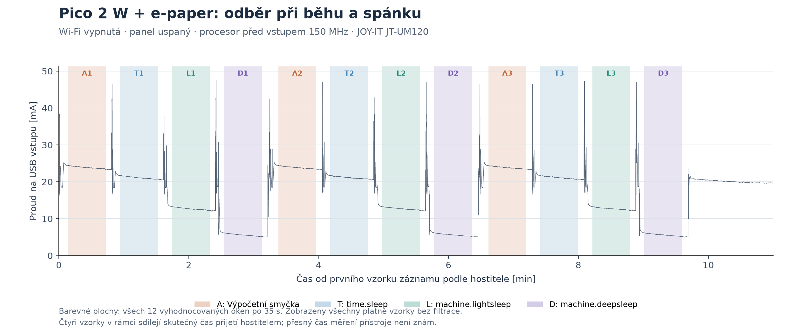
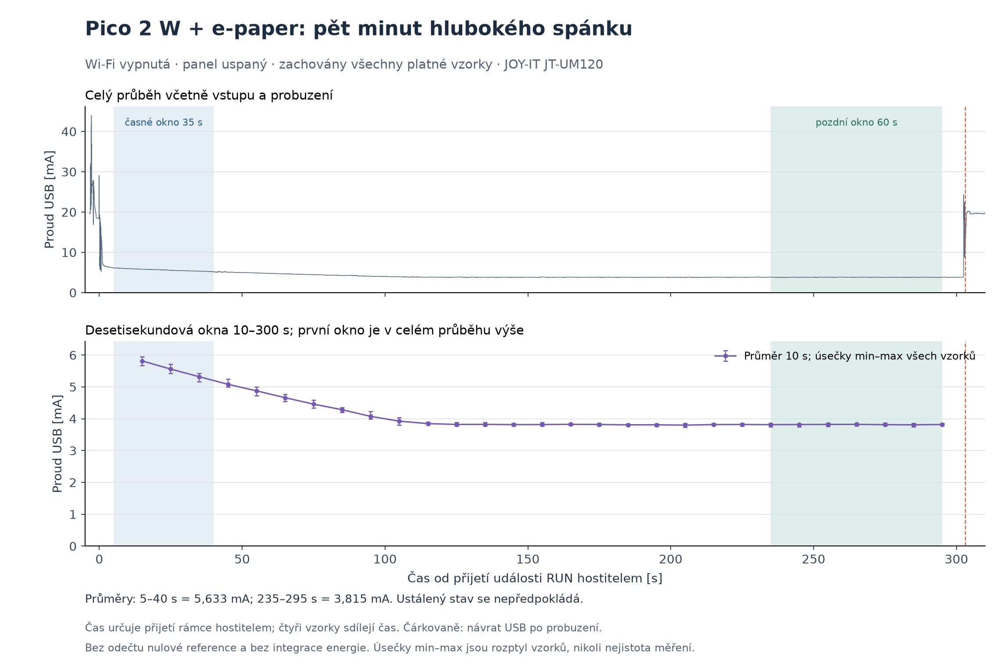

# Pico 2 W: měření odběru přes JT-UM120, 27. 9. 2026

Pozdější [optimalizace pinů připojeného displeje](POWER-OPT-MAC-20260927.md)
snížila odběr deepsleep přibližně na 0,60 mA. Níže zůstává původní měření
s tehdejší přípravou pinů a jeho samostatná nezatížená reference.

**Všechny čtyři měřené režimy fungovaly.** U celé sestavy Pico 2 W s připojeným
Waveshare Pico-ePaper-2.9 B/W V2 byl v pozdním okně pětiminutového `deepsleep`
naměřen průměr **3,81 mA / 19,38 mW**. Jde o USB vstup celé sestavy při vypnuté
Wi-Fi a uspaném displeji, nikoli o samotný RP2350 nebo kompletní aplikační cyklus.
Příčina zbytkového odběru ani počátečního poklesu nebyla tímto měřením určena.

## Srovnání režimů

První čtyři řádky: tři opakování po 45 s, z každého vyhodnoceno okno 5–40 s
od hostem přijaté události RUN. Poslední řádek je samostatný 300s deep sleep,
okno 235–295 s. Krátká okna nejsou automaticky ustálené hodnoty.

| Režim | Proud, průměr | Napětí, průměr | Příkon, průměr | Rozsah průměrů tří opakování |
| --- | ---: | ---: | ---: | ---: |
| Výpočetní smyčka, CPU 150 MHz | 23,87 mA | 5,0677 V | 120,99 mW | 23,857–23,896 mA |
| `time.sleep_ms(45000)` | 21,14 mA | 5,0692 V | 107,18 mW | 21,134–21,156 mA |
| `machine.lightsleep(...)`, USB připojené | 12,73 mA | 5,0741 V | 64,57 mW | 12,708–12,739 mA |
| `machine.deepsleep(45000)` | 5,63 mA | 5,0805 V | 28,58 mW | 5,616–5,635 mA |
| `machine.deepsleep(300000)`, pozdní minuta | **3,81 mA** | **5,0817 V** | **19,38 mW** | Jeden běh; jednotlivé vzorky 3,75–3,87 mA |

Ve stejně zvolených krátkých oknech má lightsleep o **39,75 %** a deepsleep
o **73,33 %** nižší průměrný příkon než běžné čekání. Rozsah opakování vyjadřuje
opakovatelnost, nikoli celkovou nejistotu měřidla. Pozdní 300s hodnota používá
jinou dobu od vstupu do režimu; neslučovat ji se třemi krátkými opakováními.

[Číselná analýza krátkých oken](evidence/mac-20260927-power/short-analysis.json)
a [graf srovnání](evidence/mac-20260927-power/current-comparison.png).

## Pokles na začátku a delší spánek

Ve všech 12 krátkých oknech mezi prvními a posledními pěti sekundami klesl
průměrný proud přibližně o 0,77–0,87 mA. Tento společný průběh nelze bez dalšího
měření připsat konkrétní části Pica, displeji ani měřáku.

Samostatný dlouhý běh měl v okně 5–40 s průměr 5,633 mA a v okně 235–295 s
3,815 mA. V pozdním okně bylo 6 000 vzorků, 5.–95. percentil 3,78–3,85 mA.
Průměr prvních a posledních deseti sekund tohoto pozdního okna se lišil pouze
o +0,00691 mA. To popisuje pozorovanou stabilitu konkrétního okna;
nejde o nezávislou kalibraci ani obecnou záruku ustálení za všech podmínek.

[Úplná analýza dlouhého běhu](evidence/mac-20260927-power/long-analysis.json).

## Zapojení a postup

Majitel výslovně potvrdil větev **USB-C hub → vstup JT-UM120 → výstup JT-UM120
→ Pico 2 W s displejem**. Samostatný PC port měřáku byl ve stejném hubu.
Pico nemělo další napájení. Měří se jiná fyzická sestava než historická deska
na Linuxu; ve veřejných záznamech je označená `test-board-2`.

- Firmware zůstal `v1.30.0-preview.87.g9a8542bb24`, sestavený z
  `9a8542bb242d04bcf20ddfb7b09b8047759bfa92`; během měření se neflashoval.
  UF2 SHA256 `33ccf3abf94a3a2a784c0d6d08f32d4d722cf9a89a7074331b33788c60cfbe60`.
- Po přepojení nereagovalo otevření CDC portu. Fyzický reconnect majitele
  umožnil zachytit normální boot v REPL. Aktuálních 29 souborů bylo nově
  soukromě zálohováno a hashově ověřeno; jeden datový soubor se od předchozího
  funkčního testu změnil. Nový stav se zachovává.
- Původní main se dočasně odložil. Testovací main pouze oznámil boot a skončil;
  jednotlivá měření spouštěl host. Řízený reset odstranil stav původní aplikace.
- Před každým oknem: STA/AP inactive, `WLAN.deinit()` a ověření WL_REG_ON low.
  Pouhé `active(False)` by v tomto driveru neprokazovalo vypnutí rádia.
  LED na CYW43 se během měření neovládala.
- Připnutý vendor driver inicializoval panel bez refresh, poté provedl sleep
  `0x10/0x01`, čekání 2 s a RST low. Stejná příprava před všemi okny;
  přítomnost displeje a jeho obvodů se zahrnuje do výsledku.
- CPU měl před vstupem 150 MHz. Časovaný lightsleep v tomto portu ponechává
  USB hodiny při připojeném hostu; tato čísla nejsou měřením lightsleep bez USB.
  Každé ze tří oken dokončilo přibližně 45 s jedním voláním, bez předčasných návratů.
- Tři 45s a jeden 300s deepsleep ověřily skutečné zmizení a návrat USB,
  `DEEPSLEEP_RESET=4`, alarm 64, `HAD_SWCORE_PD`, retenci POWMAN a boot counter.
  Dlouhý běh: USB absence 302,973 s, RTC +302 s. Host interval zahrnuje návrat
  USB a boot; nejde o přesnou kalibraci LPOSC.

[Události krátkých běhů](evidence/mac-20260927-power/device-events.jsonl),
[události dlouhého běhu](evidence/mac-20260927-power/long-device-events.jsonl)
a [plán/provenance](evidence/mac-20260927-power/measurement-plan.json).

## Měřidlo a kvalita záznamu

JT-UM120 poskytoval přes HID čtyři vzorky na rámec, přibližně 100 vzorků/s.
Krátká sada obsahuje 66 012 záznamových vzorků, dlouhá 33 008; u obou bylo
**0 neplatných CRC a žádná zaznamenaná mezera mezi datovými rámci přes 0,2 s**.
Analýza znovu dekódovala všechny raw rámce, porovnala je se vzorky a ověřila
pokrytí každého okna včetně jeho okrajů. Nuly ani špičky se neodstraňovaly.
Čtyři vzorky sdílejí čas přijetí rámce hostitelem; čas přístroje a přesný počet
případných ztracených vzorků nejsou známé. Kratší špičky mohou uniknout.

Výrobce uvádí rozlišení 10 µA a přesnost ±0,05 % + 2 číslice. Měřidlo nebylo
nezávisle kalibrováno; rozlišení není totéž co přesnost. Dokumentace sama
neprokazuje galvanickou izolaci PC portu ani vyloučení vlastní spotřeby.
[Specifikace a manuál Joy-IT](https://joy-it.net/en/products/JT-UM120).

Měřicí handshake/keepalive a dekódování vycházejí z
[připnutého původního loggeru](https://github.com/rsie-dev/JT-UM120-usb-power-data-logger/blob/c4c58c5efe8a05ef2bca8e0bc67ed8a6ed2a8ece/src/usb_multimeter/usb_meter.py)
a staticky ověřeného [oficiálního PC programu](https://joy-it.net/files/files/Produkte/JT-UM120/JT-UM120_PC-Software.zip).
Použity byly pouze zprávy 0x81/0x82/0x83; žádné změny výstupního napětí,
rychlonabíjecí trigger, kalibrace nebo reset měřáku. Oficiální EXE se nespouštěl.

Veřejný export obsahuje grafy, analýzy, anonymizované boot události a
[jednosekundové souhrny krátkého](evidence/mac-20260927-power/short-trace-1s.csv)
a [dlouhého záznamu](evidence/mac-20260927-power/long-trace-1s.csv).
Úplné raw rámce a vzorky zůstávají soukromě; grafy a analýzy používají plné údaje.
SHA256 v analýzách odkazují na původní lokální důkazy, nikoli na anonymizované kopie.
Nezveřejňují se původní aplikace, konfigurace, zálohy flash ani inventáře souborů.

## Konečný stav a omezení

První doplňková kontrola měřáku bez zátěže se **neuskutečnila**: během vyhrazeného
okna nebylo zachyceno odpojení Pica. [Záznam prvního pokusu](evidence/mac-20260927-power/no-load-attempt.json)
má FAIL kvůli chybějícímu odpojení, nikoli kvůli selhání spánku.

**Opakovaná kontrola ve 14:34 UTC zachytila použitelnou nezatíženou referenci:**
průměr **0,05541 mA (55,41 µA)**, rozsah **0,04–0,08 mA**, napětí 5,07555 V.
Majitel potvrdil přibližně 30s odpojení jen USB kabelu od Pica; měřák, jeho
PC kabel, výstupní kabel a hub zůstaly zapojené. Pevné okno 5–20 s po
zachyceném zmizení USB obsahuje 1 504 vzorků / 376 rámců, bez neplatných CRC
a s největší mezerou 44,63 ms. [Analýza reference](evidence/mac-20260927-power/no-load-reference.json)
ověřila také všech 1 256 raw rámců a 5 020 vzorků celého záznamu.

Celý druhý záznam skončil `OSError: read error` na HID a jeho původní stav
ERROR / workflow FAIL se nemění. Vybrané okno končí 15,48 s před chybou;
čas návratu USB se nezachytil. Pozdější pasivní enumerace už viděla Pico
i měřák znovu, běh původní aplikace se nekontroloval. Reference platí pro
uvedené zapojení a není nezávislou kalibrací ani určením příčiny nenulové
indikace. Žádná hodnota nuly ani vlastní spotřeba měřáku se od výsledků
spánkových testů neodečítala.

[Obnova původních souborů](evidence/mac-20260927-power/restoration-result.json)
skončila **PASS v 13:46:06 UTC**: všech 29 souborů má velikost a SHA256 shodné
s čerstvou zálohou před měřením, původní `main.py` je vrácený a čtyři testovací
soubory jsou odstraněné. Změna datového souboru vzniklá před měřením je zachovaná.
UTC RTC a uložené backup registry byly obnoveny a ověřeny. Experimentální
firmware zůstal beze změny. Při této obnově bylo rádio vypnuté, panel uspaný
s RST=0 a aplikace zastavená ve friendly REPL. Následná fyzická připojení při
kontrole nuly mohla spustit původní aplikaci; její nynější běh nebyl ověřen.
Aktuální odběr po připojení proto neztotožňovat s hodnotou 3,81 mA výše.

Energie úplného aplikačního cyklu s Wi-Fi a refresh displeje se neměřila.
Původní problém Wi-Fi reconnectu tímto testem vyřešen nebyl.
