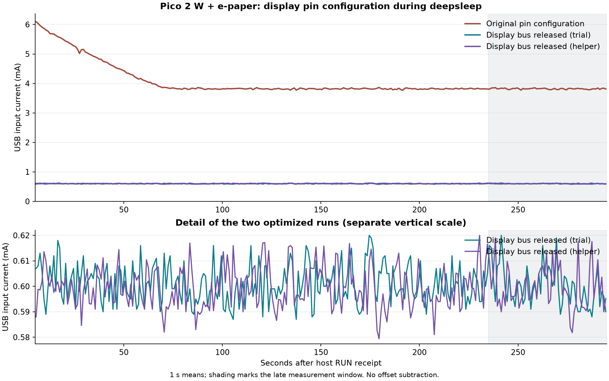

# Pico 2 W s e-paperem: optimalizace deepsleep, 27. 9. 2026

**S připojeným Waveshare Pico-ePaper-2.9 B/W V2 klesl naměřený USB odběr
z 3,82 na 0,60 mA**, přibližně o **84 %**. Pomohlo uvolnit signálové piny po
úplném uspání panelu. Firmware zůstal beze změny. Jde o celou konkrétní sestavu
s vypnutým rádiem, nikoli samotný RP2350 nebo průměr úplného aplikačního cyklu.

Navazuje na [první měření všech režimů](POWER-MAC-20260927.md). Pro toto
srovnání se zopakovala také výchozí konfigurace; starší hodnoty se nepřepisují.
Pozdější [samostatný test GP25](POWER-GP25-MAC-20260927.md) dále snížil odběr
na 0,3708 mA; zahrnuje novější obnovu a nové vizuálně ověřené překreslení.

## Stejně dlouhé spánky

Každý běh trval 300 s. Tabulka používá stejné pevné okno 235–295 s od hostem
přijaté události RUN, 6 000 vzorků na okno. Proud ani příkon nejsou korigované
o dřívější nezatíženou referenci měřáku.

| Varianta | Proud | Příkon | Výsledek |
| --- | ---: | ---: | --- |
| Nově zopakovaný výchozí panel sleep | 3,8195 mA | 19,3759 mW | PASS |
| Panel sleep + uvolnění pinů, první 300s běh | 0,6000 mA | 3,0498 mW | PASS |
| Přesný veřejný helper, druhý 300s běh | 0,5999 mA | 3,0492 mW | PASS |

První srovnání znamená snížení proudu o 84,29 % a příkonu o 84,26 %.
Proud v optimalizovaném pozdním okně měl rozsah 0,58–0,62 mA. Jde o výsledek
těchto běhů a tohoto zapojení, nikoli zaručený odběr každého kusu.

Opakování s přesným veřejným helperem potvrdilo prakticky stejný průměr;
jeho jednotlivé vzorky byly 0,57–0,63 mA. Obě optimalizovaná pozdní okna měla
5.–95. percentil 0,59–0,62 mA.

[Úplné analýzy a jednosekundové průběhy](evidence/mac-20260927-power-opt/README.md)
obsahují i krátké varianty uvedené níže.

## Co se změnilo

Po dokončeném refresh a vendor sleep `0x10/0x01`, čekání 2 s a RST low:

1. GP12/RST zůstává výstupem v logické nule.
2. GP8/DC, GP9/CS, GP10/SCK, GP11/MOSI a GP13/BUSY přejdou do vstupu bez pullů.
3. Na GP8–GP13 se vypnou vstupní buffery a oba pull rezistory přes atomický
   clear alias PADS_BANK0, maskou `0x4c`.
4. Následuje časovaný `machine.deepsleep()`. Po alarmovém bootu se znovu
   nastaví všechny směry GPIO a SPI před dalším přístupem k displeji.

Původní vendor sleep ponechával některé signály aktivně řízené a BUSY
s pull-up. Změna jejich stavu prokazatelně odstranila podstatnou část odběru.
Možné napájení přes signály a chování převodníku úrovní jsou vysvětlující
hypotéza; konkrétní proudová cesta se samostatně neměřila. Měření také
neprokazuje úplné odpojení napájení panelu. Dostupné
[schéma Waveshare](https://files.waveshare.com/upload/6/62/Pico-ePaper-2.9.pdf)
navíc neobsahuje všechny prvky vyfotografované revize desky.

Další krátké screeningy měly délku 45 s, vždy okno 5–40 s a 3 500 vzorků.
Všechny jejich alarmové návraty prošly. Krátké okno výchozího 300s běhu mělo
5,3715 mA; nesrovnávat tyto hodnoty s pozdní minutou jako stejné podmínky.

| Změna vůči výchozímu panel sleep | Proud, 5–40 s |
| --- | ---: |
| Pouze uvolnění pinů panelu | 0,5951 mA |
| Pouze vypnutí vstupních bufferů GP0–GP29 kromě GP23 | 5,5321 mA |
| Pouze explicitní vypnutí USB PHY a izolace | 5,5053 mA |
| Uvolnění pinů panelu + vypnutí ostatních vstupních bufferů | 0,6022 mA |
| Uvolnění pinů panelu + vypnutí USB PHY a izolace | 0,5784 mA |

Rozdíl posledního řádku proti samotnému uvolnění pinů je pouze 16,7 µA,
méně než dva kroky rozlišení měřáku. Jediné krátké opakování neprokazuje
další užitečný přínos USB zásahu. Výsledný helper proto obsahuje jen ověřenou
úpravu pinů displeje. Změna C firmwaru ani nové flashování nebyly potřeba.

## Použití pomocného modulu

[pico_epaper29_lowpower.py](pico_epaper29_lowpower.py) obsahuje
`park_after_sleep()`. Je určený pouze pro Pico 2 W / RP2350 a uvedené zapojení.
Ověřuje výstupní latch, output-enable a nastavení padů; po vypnutí vstupních
bufferů nelze používat `Pin.value()` jako ověření fyzické úrovně.

Pořadí v aplikaci musí být: dokončení refresh/BUSY s timeoutem, úplné uspání
panelu včetně čekání, `park_after_sleep()`, flush a uzavření souborů, `os.sync()`,
časovaný deepsleep. Předem je také nutné ukončit práci rádia a workerů.
Helper sám neposílá příkaz panel sleep, nevypíná Wi-Fi a nedokončuje
asynchronní refresh. Časovaný deepsleep restartuje Python; heap se nezachová.

Po zavolání helperu už nesmí následovat čtení BUSY ani komunikace s panelem
bez obnovy všech pinů a SPI. Pouhé `init()` existující instance některých
driverů směry GPIO neobnovuje. V testu se vždy vytvářela nová instance
s výslovnou inicializací všech pinů.

**Původní aplikace nebyla upravena.** Používá odlišnou cestu uspávání a její
integrace musí zajistit obnovu GPIO/SPI, kterou samotné `init()` driveru
neprovádí. Samotné vložení helperu by nezajistilo
správný další refresh. Naměřený režim proto není automaticky aktivovaný
v původní aplikaci po následujícím resetu.

## Ověření a podklady

Pico 2 W, ve veřejných podkladech `test-board-2`, mělo displej připojený během
všech těchto běhů. Potvrzené zapojení zůstalo hub → JT-UM120 IN → OUT →
Pico s displejem; PC port měřáku ve stejném hubu, žádné další napájení Pica.

Firmware `v1.30.0-preview.87.g9a8542bb24`, zdroj
`9a8542bb242d04bcf20ddfb7b09b8047759bfa92`, UF2 SHA256
`33ccf3abf94a3a2a784c0d6d08f32d4d722cf9a89a7074331b33788c60cfbe60`.
Rádio se před každým během plně deinitializovalo a WL_REG_ON ověřil low.
Vendor driver byl připnutý na commit
`c9bcd84db5adf5f085353649a8a5c31492bc5fb8`.

Příprava každého měřicího běhu inicializovala řadič bez refresh a dokončila
panel sleep. Samostatná závěrečná kontrola navíc vykreslila skutečný obraz A
před druhým optimalizovaným 300s během a nový obraz B po jeho alarmovém bootu.
Refresh není součástí tabulkových spánkových oken.

Host ověřuje zmizení a návrat USB, `DEEPSLEEP_RESET=4`, alarm 64,
`HAD_SWCORE_PD`, retenci POWMAN, právě jeden nový boot a postup RTC.
Nejde o kalibraci LPOSC. Samostatný HID záznam používá pouze čtecí handshake
a keepalive; nemění napětí, kalibraci ani nastavení měřáku.

Analýza znovu ověřuje CRC všech raw rámců, jejich přesné mapování na vzorky,
pořadí událostí, pokrytí a okraje oken i mezery mezi rámci. Čtyři vzorky
sdílejí čas přijetí rámce hostitelem; přesné časy zařízení a ztracené vzorky
nejsou známé. Neodstraňují se nuly ani špičky. Měřidlo nebylo nezávisle
kalibrováno; [výrobce](https://joy-it.net/en/products/JT-UM120) uvádí
rozlišení 10 µA a přesnost ±0,05 % + 2 číslice.

Všech osm spánkových běhů má PASS. Nezávislý opakovaný audit všech záznamů
ověřil 29 925 rámců s platným CRC a přesný převod na 119 668 vzorků,
z toho 118 844 v záznamové fázi a 824 při závěrečném vyčtení. Žádné okno
nemělo zaznamenanou mezeru rámců přes 0,2 s. Oba optimalizované 300s běhy
měly RTC +301 s a USB absenci přibližně 302,7 s včetně návratu a bootu.

Přesný testovaný helper má SHA256
`52d992cb94ab9fe8ebb0b6cc80a0cde7155bbc1879f81d3ee6746d57a3ff0dd0`.
Obrazy A/B mají automatické kontroly překreslení, BUSY a opětovného uspání
PASS; B navazuje právě jedním alarmovým bootem na A. Jeho nový text je
`B: OPTIMIZED SLEEP OK`, s černým obdélníkem vpravo. **Majitel následně potvrdil správný nový text B i černý obdélník vpravo: vizuální
kontrola PASS.** [Samostatné potvrzení](evidence/mac-20260927-power-opt/visual-confirmation.json)
doplňuje původní automatické záznamy; jejich stav `NOT_VERIFIED` se nepřepisuje.

[Konečná obnova](evidence/mac-20260927-power-opt/restoration.json) skončila
PASS v **15:19:07 UTC**. Všech 29 původních souborů bylo obnoveno a porovnáno
velikostí i SHA256 s novou zálohou bezprostředně před optimalizací. Pět
dočasných souborů bylo odstraněno, původní `main.py` vrácen, UTC RTC a
zapůjčené backup registry obnoveny a ověřeny. Firmware zůstal stejný.
Pico bylo ponecháno ve friendly REPL, aplikace zastavená, rádio vypnuté,
displej uspaný a piny uvolněné podle helperu. **V konečném REPL stavu Pico
není v deepsleep**; hodnotu 0,60 mA proto nelze označit za jeho nynější odběr.
Další reset spustí původní aplikaci. Měřicí procesy skončily.

Energie úplného cyklu s Wi-Fi a refresh se neměřila. Dřívější problém
s Wi-Fi reconnectem zůstává otevřený.

## Navazující kandidáti a jejich stav

Následná kontrola [samostatného schématu Pico 2 W, revize 2](https://datasheets.raspberrypi.com/picow/pico-2-w-schematic.pdf)
našla dva další odběry. Níže je původní odhad a nynější stav jejich ověření;
výpočty podle schématu samy o sobě nejsou naměřené úspory.

- **VSYS měřicí cesta, nově ověřené softwarové vypnutí:** R5 = 20 kΩ a R6 = 10 kΩ jsou
  propojené tranzistorem Q1, jehož gate řídí WL_CS / GP25. V obou úspěšných
  optimalizovaných 300s bězích zůstával GP25 výstupem high
  (`SIO_OUT=0x02000300`, `SIO_OE=0x02801000`). Nezatížený dělič při VSYS
  kolem 4,8 V odpovídá přibližně 0,16 mA. GPIO29 sdílí alternativní funkci
  PIO pro rádio; samotný SIO_OE nedokazuje skutečný směr tohoto pinu,
  takže skutečný odběr děliče může být jiný. Následný [A/B test GP25 low](POWER-GP25-MAC-20260927.md)
  po úplném vypnutí rádia prokázal 0,5983 → 0,3708 mA, čistý alarmový boot,
  opětovnou inicializaci ovladače rádia a funkční překreslení displeje.
  Nové IO_BANK0 záznamy navíc ukázaly GP29 jako PIO2 výstup LOW, takže
  odhad nezatíženého děliče nepopisuje jeho skutečné zatížení.
  Původní test vypnutí vstupních bufferů GP25 high zachovával.
- **VBUS dělič, jiné napájení:** R10 = 5,6 kΩ a R1 = 10 kΩ tvoří cestu
  VBUS → R10 → WL_GPIO2 → R1 → GND. Nezatížený dělič při 5,083 V vychází
  přibližně na 0,326 mA. Dalším kandidátem je srovnání napájení přes VSYS
  bez napětí na VBUS, se stále připojeným displejem. Skutečný rozdíl zahrne
  také změnu podmínek měniče a zatížení WL_GPIO2; nelze jej prostě odečíst
  od 0,60 mA. Obecný Pico 2 W datasheet ve Figure 8 uvádí jiné R10 = 10 kΩ;
  zde se používá samostatné schéma, osazení konkrétního kusu nebylo měřeno.

GP25 má nyní samostatný ověřený [helper](pico2w_vsys_lowpower.py); původní
panelový helper ani firmware se neměnily. Jiné napájení bez VBUS zůstává
**NOT TESTED** a jeho teoretický přínos nelze odečíst ani od nových 0,37 mA.
