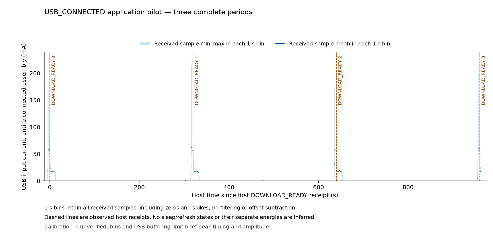

**Výsledky relace 30. 9.–1. 10. 2026; V3 a následná obnova dokončeny.**

Nová relace doložila syntetický test živého watchdogu při C startu, platnou OTP hodnotu LPOSC, dvě měření za bdělého běhu, čtyři časovací cykly a tři celé aplikační periody. První aplikační pokus skončil před uspáním; V3 s dekodérem aktuální aplikace následně dokončil všechny tři periody. Celkem jde o **sedm nových úspěšných návratů z deep sleep**; startup watchdog reset se počítá samostatně. Vizuální kontrola konečného obrazu je nyní **PASS**: uživatel potvrdil správný obraz, orientaci a černou/bílou; přiložená fotografie potvrzuje čitelné zobrazení. Jde o kontrolu posledního obrazu, nikoli o samostatné vizuální ověření všech šesti refreshů.

Sestava: Pico 2 W, připojený Waveshare Pico-ePaper-2.9 B/W V2 a USB. Produkční BIN má SHA256 `a0a2107db05f6ea2246cb8540e2d715b72bbcfa7a0cae1492b25cb6b7ae2ee08`; zdrojový základ je `6ce738ae0f13ab0732ed66f761a35aee04e64fab` s doloženou produkční úpravou. WDT diagnostika měla vlastní odlišný BIN. Historické stovky cyklů, dlouhé testy a starší měření spotřeby se v této zprávě nevydávají za nově provedené. [Provenance](evidence/mac-20260930-lposc-app/diagnostic-provenance.json).

Host byl znovu ověřen jako **macOS 27.2 (26B5091g), arm64**. Potvrzená měřená větev byla hub → JT-UM120 IN → OUT → Pico; PC port měřáku ve stejném hubu, bez debuggeru a dalšího napájení. Runtime zůstal `v1.30.0-preview.105.g6ce738ae0f.dirty`, ARM `RPI_PICO2_W`. C soubor odpovídá checkpointu opravy `042db1c94`; starší Git popis v BIN vznikl sestavením před tímto commitem. USB i runtime identita se ověřovaly privátně před zápisy a při návratu; veřejné timing logy používají stabilní náhradu `redacted-board-1`. **Měření bez datových vodičů USB se neprovedlo**, protože nebyl k dispozici datový blokátor ani kabel bez dat.

**Živý watchdog při startu: PASS.** Diagnostický C hook jednorázově zapnul SDK watchdog na 8000 ms před `machine_deepsleep_init()`. Inicializace zachovala ENABLE, nenulový TIME, pause flags i REASON. TIME klesl z 7 999 998 na 7 999 927 µs; měřicí úsek trval 73 µs včetně instrumentace. Následoval skutečný TIMER watchdog reset. Retenční záznam s ověřeným nonce a CRC32 doložil jedno zapnutí a jednu TIMER recovery; při recovery bylo expirované ENABLE odstraněno. Nouzové vypnutí se nepoužilo a původní aplikace se nespustila. Host čekal 13,130469 s, což není měření přesnosti timeoutu. Rozsah je výslovně **syntetický C startup před inicializací; ROM/TBYB se netestovalo**. [WDT výsledek](evidence/mac-20260930-lposc-app/live-wdt-result-public.json), [diagnostický hook](evidence/mac-20260930-lposc-app/sources/diagnostic-only.diff).

**OTP a awake FC0: PASS měření, bez nové kalibrace.** Platná OTP hodnota je 32 571 Hz. Existující POWMAN dělička `[32, 37421]` odpovídá 32 570,999145507812 Hz. OTP se jen četla. FC0 měřil LPOSC proti XOSC 12 MHz, nezávisle na děličce POWMAN; každá sada obsahuje 32 vzorků:

| Fáze | Průměr (Hz) | Minimum (Hz) | Maximum (Hz) |
| --- | ---: | ---: | ---: |
| Před časováním | 32 614,2578125 | 32 562,50 | 32 656,25 |
| Po časování | 32 601,5625 | 32 531,25 | 32 687,50 |

Kvantum jednotlivého výsledku je 31,25 Hz; desetinná místa průměru neznamenají stejnou absolutní přesnost. Zapisovatelná konfigurace FC0 byla obnovena, sledované clocks/POWMAN zůstaly shodné. Obnovení read-only status/result registrů se netvrdí. Obě měření byla za bdělého běhu bez resetu; přesnost XOSC není kalibrována a frekvence LPOSC uvnitř deep sleep nebyla měřena. [OTP](evidence/mac-20260930-lposc-app/otp-clock-readonly-public.json), [FC0 před](evidence/mac-20260930-lposc-app/fc0-lposc-public.json), [FC0 po](evidence/mac-20260930-lposc-app/fc0-after-timing-public.json).

**Čtyři nové časovací cykly: PASS úplnosti důkazů.** Interval začíná host časem před zápisem ACK pro SLEEP a končí přijetím dalšího READY:

| Požadavek | Opakování | Host ACK→READY (s) | Diagnostický RTC interval (s) |
| --- | ---: | ---: | ---: |
| 30 s | 1 | 33,454643667 | 32 |
| 30 s | 2 | 33,466423583 | 33 |
| 300 s | 1 | 305,086132916 | 302 |
| 300 s | 2 | 305,183163084 | 303 |

Všechny návraty mají cause 4, POWMAN alarm flag 64 a HAD bit 25. První cyklus každé sady překročil půlnoc; watchdog scratch hodnoty se nezachovaly při žádném ze čtyř návratů. Obě sady skončily PASS po běžném resetu s cause 3, completed 2 a boot 4. Následně byl ověřen přesný firmware, zastavená sada, shodné soubory a friendly REPL. Host intervaly byly nezávisle přepočteny z exportovaných monotonic timestampů. [30s záznam](evidence/mac-20260930-lposc-app/timing-30s-events-redacted.jsonl), [300s záznam](evidence/mac-20260930-lposc-app/timing-300s-events-redacted.jsonl), [30s postcheck](evidence/mac-20260930-lposc-app/timing-30s-post-public.json), [300s postcheck](evidence/mac-20260930-lposc-app/timing-300s-post-public.json).

Průměry jsou 33,460533625 s a 305,134648 s. Model `host interval = konstantní režie + sklon × požadavek` dává **sklon 1,006200423611111**, zdánlivých **+6200,424 ppm (+0,620042 %)** a průsečík 3,274520917 s. Rozsah dvou opakování je 11,780 ms a 97,030 ms. Jde o zdánlivý host sklon: ACK ohraničuje write API, zatímco READY zahrnuje USB enumeraci, celý boot, přípravu panelu (2119 ms bez refreshu) a kontrolu BIN. Rádio se neinicializovalo. Také RTC interval obsahuje kód kolem spánku. Model odstraní jen konstantní režii; dvě opakování nerozliší drift ani proměnlivou režii. `PASS` neoznačuje splněný práh přesnosti a **nejde o kalibraci oscilátoru**. [Analýza a limity](evidence/mac-20260930-lposc-app/timing-analysis-public.json).

**Aplikační pokus 1: FAIL, nula cyklů.** Wi-Fi a GO marker byly ověřeny, ale zařízení zapsalo pouze BOOT→FAIL typu Stop: žádná DOWNLOAD_READY hranice ani sleep. Meter capture má PASS: 12 676 recording vzorků za 126,699901 s, 100,015863469 Hz, nula neplatných rámců, mezer nad 200 ms i detekovaných skoků hodin; nejdelší mezera 185,090083 ms. Záznam skončil stop souborem před plánovanými 1800 s. Analýza neúplnou aplikační periodu odmítla; žádná uznaná cycle energy nevznikla. Globální integrál neúspěšného záznamu není energií aplikačního cyklu ani spánku. [Pokus 1](evidence/mac-20260930-lposc-app/pilot-failed1-public.json), [meter souhrn](evidence/mac-20260930-lposc-app/attempt1/meter-summary.json), [odmítnutí analýzy](evidence/mac-20260930-lposc-app/failed1-analysis-rejection-public.json).

Následné RAM sondy selhávaly na BMP hlavičce bez uspání či refreshu. HTTP/1.0 bez Accept znovu vrátilo shodná ne-BMP těla. S obnovenou DNS politikou uspěl nakonfigurovaný server 0, jeho výsledek odpovídal DHCP resolveru; cache/fallback se nepoužily. POST i GET vrátily 200 a 2293 bajtů, stále `bmp_header`. Pozdější GET vrátil 200, 2283 bajtů, klasifikaci `OTHER_IMAGE` / `OTHER`. Přesný formát jednotlivých starších odpovědí nebyl zaznamenán. Tyto výsledky nepotvrdily DNS jako příčinu ani chybu deep sleep. [HTTP parita](evidence/mac-20260930-lposc-app/http10-parity-public.json), [DNS sonda](evidence/mac-20260930-lposc-app/dns-policy-http-bmp-public.json), [GET klasifikace](evidence/mac-20260930-lposc-app/http-image-format-public.json).

**Dekodér aktuální aplikace: samostatný Z2 probe PASS.** V 00:11:43 CEST dne 1. 10. (22:11:43 UTC dne 30. 9.) GET vrátil HTTP 200 a 2187 bajtů Z2. Dekodér ze zdroje aplikace `fd54396020b4154eb23c0188153a8d6f9a5b2813` vytvořil přesně 37 888 pixelů pro 296 × 128 a dvě roviny po 4736 bajtech; červená rovina byla prázdná. Původní BMP-only fixture tuto podporu Z2 postrádala. Úspěch nové sondy zpětně neurčuje formát každého staršího těla. Šlo pouze o GET v RAM, bez POST, resetu, sleep či refreshu, s vypnutým rádiem a shodnými originály/firmwarem. Použití dekodéru neznamená nasazení celé aplikace nebo převzetí jejích BWR/V4 defaults pro B/W V2 panel. Soukromý zdroj se nepublikuje, jen jeho hash. [Z2 probe](evidence/mac-20260930-lposc-app/current-decoder-probe-public.json).

**V3 pilot: tři celé periody PASS.** Uzavřený proces skončil exit 0, zařízení dosáhlo COMPLETE 3 a následný postcheck ověřil produkční BIN, zachované originály a zastavený test ve friendly REPL. Každý ze tří návratů má cause 4 a POWMAN alarm 64. Proběhlo šest full refreshů; dvojice trvaly 12 354, 12 333 a 12 340 ms. RTC intervaly kolem uspání byly 300 679, 300 687 a 300 695 ms. Čtyři úspěšně dekódované payloady měly 2189, 2195, 2199 a 2197 bajtů; poslední se již nezobrazoval. Legacy `bmp_bytes` znamená velikost obrazových dat, nikoli potvrzení BMP či Z2 každého přenosu. [Zařízení](evidence/mac-20260930-lposc-app/attempt3/device-events.jsonl), [postcheck](evidence/mac-20260930-lposc-app/attempt3/device-post-public.json), [konečný proces](evidence/mac-20260930-lposc-app/attempt3/root-completion-public.json).

Energetické periody jsou přesně první přijetí DOWNLOAD_READY n → první přijetí n+1 na stejných host monotonic hodinách. Primární integrace používá lichoběžníky z průměrů rámců v čase jejich přijetí:

| Perioda | Host délka (s) | Energie (J) | Časový průměr proudu (mA) |
| --- | ---: | ---: | ---: |
| 1 | 319,916984959 | 3,150128518 | 1,945016 |
| 2 | 319,867285500 | 3,114768973 | 1,923372 |
| 3 | 320,104240250 | 3,121635040 | 1,926054 |

Průměr činí **3,128844177 J na celou periodu**. Capture má 98 384 vzorků za 983,733811875 s, 100,006728 Hz, nula neplatných rámců a mezer nad 200 ms; maximum mezery je 180,080166 ms. Striktní analýza ověřila raw CRC, shodu všech dekódovaných vzorků, hodiny i úplné pokrytí period. Všech deset nulových vzorků i špičky zůstaly započteny; bez filtru nebo odečtu offsetu. Nominálních 10 ms na vzorek slouží jako citlivostní model. [Úplná analýza](evidence/mac-20260930-lposc-app/attempt3/analysis-public.json), [capture souhrn](evidence/mac-20260930-lposc-app/attempt3/meter-summary-public.json).

Jde o celou sestavu s **připojeným USB**, včetně panelu, rádia, markerů a následného stažení. Přesná host hranice samotného sleep ani refreshu neexistuje; samostatná energie těchto stavů se netvrdí. USB buffering omezuje časové rozlišení krátkých špiček a měřidlo nemá doloženou absolutní kalibraci. Výsledek není no-data USB test ani odhad provozu na baterii. Vizuální potvrzení posledního obrazu má vlastní navazující důkaz.

**Konečná obnova po V3: PASS.** Před flashováním byla nezávisle ověřena čerstvá 4MiB záloha; návrat produkčního BIN ověřil shodný filesystem. Nejnovější completed restoration potvrzuje všech 29 původních souborů, 7 adresářů, tři backup regiony podle čerstvého snapshotu před V3 a RTC jako tento původní čas plus host elapsed. RTC má sekundovou kvantizaci a počáteční bracket 46,0925 ms. Deset vlastněných souborů bylo odstraněno a zaparkovaný původní main vrácen poslední. Produkční BIN zůstal shodný, panel zaparkovaný bez refreshu, rádio/BLE neaktivní a friendly REPL. Žádný reset ani spuštění původní aplikace po obnově. [Záloha](evidence/mac-20260930-lposc-app/full-backup-public.json), [návrat BIN](evidence/mac-20260930-lposc-app/production-return-launch-public.json), [nová obnova](evidence/mac-20260930-lposc-app/attempt3/restoration-result-public.json), [vazba na čerstvý stav](evidence/mac-20260930-lposc-app/attempt3/fresh-state-restoration-public.json).

Původní BMP-only kód a konfigurace aplikace byly obnoveny beze změny. Podpora Z2 byla součástí dočasného měřicího programu; aktuální BWR/V4 aplikace nebyla nasazena. Obnova souborů nedokládá úspěšný běh původní aplikace. Uživatel následně potvrdil správný poslední obraz dočasného testu a přiložil fotografii; fotografie zůstává soukromá.

Graf zachovává celý záznam včetně nul a špiček. Čára je průměr vzorků v jednosekundových intervalech, pás jejich minimum–maximum; svislé čáry označují skutečné přijetí DOWNLOAD_READY, nikoli přesný vstup do sleep.

[SVG graf](evidence/mac-20260930-lposc-app/attempt3/plots/current.svg), [CSV pro graf](evidence/mac-20260930-lposc-app/attempt3/trace-bins.csv), [potvrzený fyzický obraz](evidence/mac-20260930-lposc-app/attempt3/visual-public.json).
