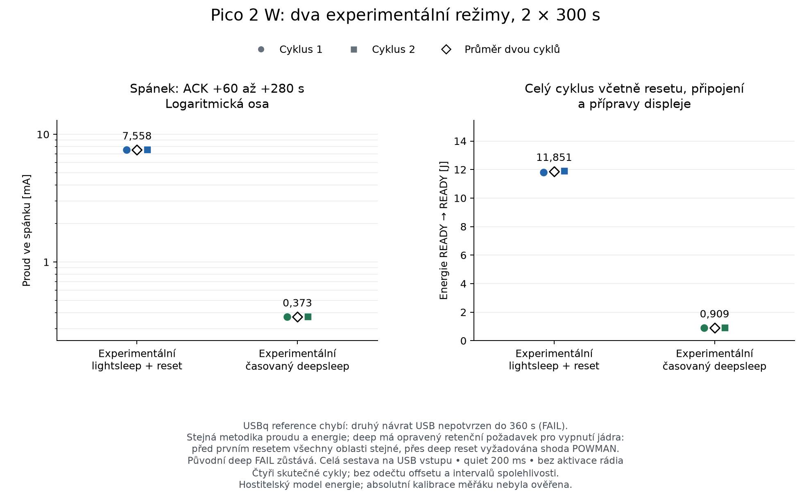

# Diagnostika předčasného probuzení a RTC, Mac, 29. 9. 2026

Stav: sada uzavřena, dvě platná měření a čtyři zachované neúspěšné pokusy.
Závěrečná obnova PASS; ponechán experimentální firmware. Tento soubor nenahrazuje uzavřené výsledky
v `RESULTS-METER-MAC-20260929.md`. Časy níže jsou UTC; zpráva zachycuje stav
při uzavření měření.

## Hlavní výsledek nové sady

Nově měřen již existující kandidát `91e91d58de` na Pico 2 W s připojeným
Waveshare B/W V2; produkční implementace firmwaru se v této sadě neměnila.
Dva 300s cykly v každém platném profilu, stejný RAM program, příprava panelu
bez refresh a quiet200; přesný retenční kontrakt je popsán níže.

| Režim tohoto kandidáta | Průměrný proud spánkového okna | Energie celého READY→READY cyklu |
| --- | ---: | ---: |
| `lightsleep` + reset | 7.558 mA | 11.851 J |
| Časovaný `deepsleep` | 0.373 mA | 0.909 J |

V tomto pilotu deep sleep znamenal **o 95.07 % nižší vstupní proud**
a **o 92.33 % méně energie na celý měřený cyklus** proti lightsleep
téhož kandidáta. Měřena celá sestava přes JT-UM120, bez odečtu nuly a bez
tvrzení o absolutní kalibraci; dva cykly nejsou interval spolehlivosti.
Platná upstream reference chybí kvůli neobnovenému USB ve druhém cyklu.

Předčasný lightsleep byl reprodukován a přiřazen zbytkovému SDK alarmu po
čekání na ACK. Zrychlení RTC se reprodukovalo průchodem BOOTSEL bez flashování.
Samostatně opravena příliš přísná podmínka hostitelského testu retence; původní
FAIL zůstávají zachované a úspěšný opakovaný pokus má nový kontrakt i důkazy.

## Sestava a vstupní kontrola

Stejná uživatelem potvrzená sestava: Pico 2 W, Waveshare Pico-ePaper-2.9 B/W V2
296×128, pouze napájení hub → JT-UM120 IN → OUT → Pico; PC port měřáku ve stejném
hubu. macOS 27.2 (26B5091g), ARM. BOOTSEL identifikuje RP2350 A2, QFN60.

Nová kontrola 19:54:23 ověřila identitu, skutečných 889824 B kandidátního BIN
SHA256 `0c8c1b0439fa050e1bf30c7f586f5deeb5e53b202b91877e30840411148ad12b`,
původních 29 souborů / 7 adresářů, vlastní zálohu a vypnutý watchdog. Displej byl
zaparkovaný, původní aplikace nebyla spuštěna. Firmware:
`v1.30.0-preview.104.g91e91d58de.dirty`.

## Opakování krátkého lightsleep na původním kandidátovi

Nový běh `ls-repeat-1`, dokončen 20:01:05. Jediné volání
`machine.lightsleep(2500)` v každém pokusu, skutečné USB ACK, poté prodleva 0 nebo
200 ms. Faktor RTC znamená, zda byl v daném pokusu těsně před spánkem zavolán
setter. Pokus bez setteru může převzít datum nastavené předchozím pokusem.
Pevně vyvážené pořadí 8 bloků × 4 podmínky; nejde o randomizaci.

| Prodleva po ACK | RTC setter v pokusu | Počet | `ticks_ms` délka |
| --- | --- | ---: | ---: |
| 0 ms | ne | 8 | 37–43 ms |
| 0 ms | ano | 8 | 37–41 ms |
| 200 ms | ne | 8 | 2500 ms ve všech pokusech |
| 200 ms | ano | 8 | 2500 ms ve všech pokusech |

Provedení COMPLETE / OBSERVATION_ONLY. Skutečný BIN ověřen před pokusy, bez
resetu, zápisů do souborů a volání rádia. RTC obnoveno z čerstvého snímku plus
uplynulý čas hostitele; všechny tři záložní oblasti, inventář a RAM nonce
zůstaly zachovány. Ověřen návrat do friendly REPL. Starší chyby 300s benchmarku
zůstávají beze změny. API `lightsleep` připouští předčasný návrat po události;
krátký návrat sám neprokazuje chybu firmwaru.

## RTC bez přeflashování

Před resetovacími testy byl nově ověřen a nainstalován bezpečný start do REPL,
kopie původního `main.py` a tři známé moduly displeje (celkem 33 souborů).
Čerstvé snímky a jejich SHA256 jsou svázány s důkazem přípravy z 20:02:04.

Diagnostika čte konzistentní 64bitový POWMAN čítač metodou upper/lower/upper a
časově ohraničuje celý přenos každého snímku monotónními hodinami hostitele.
Před konstruktorem RTC vyžaduje již běžící AON, aby jeho nouzová inicializace
nemohla zamaskovat zastavený čítač. RTC se během těchto pozorování nenastavuje.

| Přechod | AON čas | Čas hostitele (interval) | AON navíc vůči středu intervalu |
| --- | ---: | ---: | ---: |
| Obyčejný reset 1 | 0,908 s | 0,856–0,969 s | −0,0045 s |
| Obyčejný reset 2 | 1,119 s | 1,064–1,180 s | −0,0032 s |
| Obyčejný reset 3 | 1,114 s | 1,059–1,176 s | −0,0036 s |
| BOOTSEL, čekání 5 s, stejný BIN | 14,260 s | 7,532–7,645 s | +6,671 s |
| BOOTSEL, čekání 30 s, stejný BIN | 64,354 s | 32,688–32,798 s | +31,611 s |

Čekání v BOOTSEL se měří až po ověření identity; celý přechod zahrnuje také
vstup, komunikaci a návrat. Oba BOOTSEL pokusy neprovedly zápis firmwaru.
Následné obyčejné resety a pětisekundová kontrolní měření rychlosti čítače jsou
v mezích přenosové nejistoty. Před a po přechodech se hodnoty shodují:
TIMER=65538 (RUN + USING_XOSC), XOSC dělič 12000/0, LPOSC dělič 32/50332.

Výsledek: odchylka se reprodukuje samotným průchodem BOOTSEL. Dosavadní
pozorování nevystihují registry během pobytu v bootromu a sama neurčují přesný
mechanismus. Podle [datasheetu RP2350, §12.10.5.3](https://datasheets.raspberrypi.com/rp2350/rp2350-datasheet.pdf)
vede zdroj označený XOSC přes `clk_ref`, jehož frekvence musí odpovídat děliči
AON. Přesný [bootrom A2, tag `fd6104450fa8f55c11c0c9b54dbc69a27537130f`](https://github.com/raspberrypi/pico-bootrom-rp2350/blob/fd6104450fa8f55c11c0c9b54dbc69a27537130f/src/main/arm/varm_nsboot.c)
nastavuje pro BOOTSEL `clk_ref` na PLL_USB 48 MHz děleno dvěma. Ponechaný dělič
12000 tedy dává 2000 ticků/s. Tento zdrojově podložený mechanismus odpovídá
pozorovanému téměř dvojnásobnému běhu čítače; přímé čtení `clk_ref` uvnitř
BOOTSEL v této sadě neproběhlo. Původní chyby kontinuity se nepřepisují na PASS.

## Záznam IRQ v odděleném diagnostickém firmwaru

Kandidát plus tři izolované diagnostické zdrojové změny, stejné SDK a oprava
TinyUSB. Runtime `v1.30.0-preview.104.g91e91d58de.dirty.lsdiag1`, BIN 890816 B,
SHA256 `650e07b9c8f02807e2281143ffbf55dab440eb007114c4e0cba4311980f2ff51`.
Před zápisem vlastní nová úplná záloha, nezávislé ověření zálohy i nahraného
BIN a nezměněného rozsahu filesystemu. Přechod samotný opět pozoroval zrychlení
RTC: AON 95,225 s proti hostiteli 47,999–48,119 s. Následná rychlost byla normální.

Diagnostika neprovádí tisk v kritické části: ukládá důvod návratu a registry
před/po WFI do RAM při stále zakázaných přerušeních. Getter je čte až po návratu.
Instrumentace mění časování; nejde o měření spotřeby původního kandidáta.
Nových 32 pokusů `irq-lsdiag1-1` dokončeno 20:12:09, všechny obnovovací kontroly
prošly. Výsledek se shoduje v obou podmínkách RTC setteru.

| Prodleva ACK | Počet | Před WFI: armed | Po WFI: pending NVIC / TIMER INTS | Doba mezi RAM snímky |
| --- | ---: | ---: | ---: | ---: |
| 0 ms | 16 | `0x0a` (alarmy 1 a 3) | `0x08` / `0x08` | 31,109–38,519 ms |
| 200 ms | 16 | `0x02` (alarm 1) | `0x02` / `0x02` | 2499,856–2499,865 ms |

Před WFI nebylo v žádném pokusu čekající NVIC přerušení. Po návratu byl
zaznamenaný IRQ povolený a pouze v dolním NVIC slově; horní bylo nula.
Všechny návraty skutečně prošly WFI (nešlo o CYW43 pending, druhé jádro nebo
nezdařené nastavení alarmu). USB hodiny zůstaly zapnuté.

Krátké návraty zde souvisejí s **TIMER0_IRQ_3**, tedy SDK alarm pool, nikoli
s přímo čekajícím USBCTRL IRQ (`0x4000`). `select.poll(50)` použité pro ACK vede
přes `mp_event_wait_ms()` a `mp_wfe_or_timeout()` do SDK
`best_effort_wfe_or_timeout()`. SDK záměrně dovoluje doběhnout naprogramovanému
hardwarovému přerušení i po zrušení logického timeoutu (připnuté zdroje:
[MicroPython select](https://github.com/Rhiz3K/micropython/blob/91e91d58de8513fbf3f3e2829e49bf22843fac86/extmod/modselect.c#L401),
[SDK time.c](https://github.com/raspberrypi/pico-sdk/blob/98a542c1a62fb549ffb5d66a3e5892b06276b670/src/common/pico_time/time.c#L453)). V souladu s tím zbývá
bez prodlevy před WFI navíc ozbrojený alarm 3; po prodlevě už ne.

Kontrolní zásah `irq-poll200-1` mění jediný prvek payloadu: timeout ACK
`select.poll(50)` na `select.poll(200)`. Dalších 32 pokusů skončilo 20:17:28
s ověřenou obnovou RTC, záložních oblastí, souborů a friendly REPL. Bez prodlevy
všech 16 pokusů opět zaznamenalo alarm 3, tentokrát po 179,758–189,452 ms mezi
RAM snímky. S prodlevou 200 ms všech 16 pokusů zaznamenalo alarm 1 po
2499,855–2499,868 ms. Posun přibližně o 150 ms odpovídá změně timeoutu a
podporuje vysvětlení zbytkovým alarmem čekání v testovacím programu.

## Nové srovnání: pravidla před měřením

Nový dvoucyklový pilot pro každý ze tří profilů: kandidát `lightsleep` + reset,
upstream `09f5bb4475` pouze s opravou USB (legacy `deepsleep`), kandidát se
skutečným časovaným `deepsleep`. Původní kandidátní BIN se po diagnostice
vrátil a byl znovu ověřen; instrumentovaný BIN se pro spotřebu nepoužívá.

Všechny profily používají tentýž RAM payload, chráněných 33 souborů, přípravu
displeje bez refresh, žádnou aktivaci rádia, skutečné ACK a prodlevu 200 ms.
Jedno volání spánku má 300000 ms. Případný dřívější návrat je pozorování;
pro srovnání spotřeby takový cyklus nesplní časovou podmínku a nebude opakován
ani doplněn dalším spánkem. Pozorování návratu musí nastat 297–330 s po ACK.

Energetický interval je skutečně přijatý READY → následující READY, včetně
resetu, připojení USB, nahrání RAM programu a stejné přípravy panelu. Okno
spánkového proudu je ACK+60 až ACK+280 s. Zařízení se během spánku znovu
neotevírá jen kvůli přítomnosti CDC portu; musí se nejprve doložit návrat po
resetu. RTC se během měření nenastavuje. Žádná kompenzace nuly ani vyřazování
nul/špiček. Celý záznam musí projít původními limity CRC, mezer, hustoty a
pokrytí; dvě opakování nejsou interval spolehlivosti ani původní třícyklová sada.

První start `quiet200-ls-1` skončil ještě před prvním spánkem kvůli mezeře
příjmu měřáku 0,265522792 s. Záznam: 148 vzorků, CRC 0, capture PASS /
data quality DEGRADED, host FAIL, analýza NOT_RUN, 0 cyklů. Následovalo nové
samostatné měření `quiet200-ls-2` po uzavření předchozího záznamu se všemi
původními limity. Původ mezery nebyl přesně určen; nejde o doložené selhání Pica.

## Uzavřený profil lightsleep

`quiet200-ls-2`: host, capture, kvalita a analýza PASS. Oba cykly splnily
předem stanovené podmínky, soubory i všechny tři oblasti zůstaly shodné.

| Cyklus | Proud ACK+60…280 s [mA] | Energie READY→READY [J] | READY→READY [s] |
| --- | ---: | ---: | ---: |
| 1 | 7.534591 | 11.812399 | 303.824585 |
| 2 | 7.580773 | 11.889412 | 303.812733 |

Průměr dvou cyklů: **7.557682 mA**,
**11.850906 J**, průměrné napětí
**5.074844 V**. Celý capture: 61600 záznamových
vzorků, bez chyb CRC a mezer nad 200 ms. Obě plná energetická okna, obě
spánková okna a všech osm dílčích oken prošly včetně nezávislého přepočtu.
Jde o nově měřený profil tohoto kandidáta, nikoli o upstream referenci.

## Upstream profil: chybějící návrat USB ve druhém cyklu

Nový `quiet200-usbq-1` používá referenci `09f5bb4475` s přesnou opravou
TinyUSB, bez naší implementace časovaného deep sleep. První cyklus se vrátil
po 301,020 s od ACK a měl příčinu resetu 3. Ve druhém cyklu po ACK
20:38:48.347716 zmizel CDC port v 20:43:48.581200 (+300,234 s), ale do
limitu 360 s se nevrátil. Host zaznamenal timeout v 20:44:48.404384 a
uzavřel výsledek FAIL v 20:44:51.553767. Druhá příčina resetu ani dokončení
spánku nejsou z USB prokázány.

Měřicí capture i kvalita dat jsou PASS: 67188 záznamových vzorků, 16831 rámců včetně
řídicích a drain, nula chybných CRC, mezer nad 200 ms a skoků hostitelského
času. Celý raw → CRC → vzorky → summary důkaz nezávisle zopakován. Přesto
profil nemá dvě dokončená způsobilá opakování: analýza NOT_RUN, bez platného
srovnávacího proudu a energie. Finální kontrola souborů, záloh a REPL se
neprovedla; všechny tři záložní oblasti se shodovaly při vstupu a obou
dosažených READY.

Následná read-only kontrola hostitele nenašla Pico ani jako sériový port, ani
v USB stromu. Uživatel potvrdil fyzické připojení v BOOTSEL; přesná identita
v BOOTSEL ověřena. Jde o nové selhání této sestavy. Není určeno, zda selhal
firmware, USB ovladač, hub nebo jiná část; samotný záznam neprokazuje příčinu
historických potíží ani chybu kandidátní implementace deep sleep. Běh se
automaticky neopakuje.

## Obnova po novém USB selhání

Samostatný recovery běh dokončen PASS v 20:52:11 UTC. Před prvním zápisem
vznikla nová 4MiB záloha s nezávislým `picotool verify`; její firmware odpovídal
přesnému USBq BIN a celý filesystem se byte-for-byte shodoval s posledním
ověřeným guard snapshotem. Nahrán pouze původní kandidátní BIN; nezávisle
ověřen BIN i nezměněný rozsah filesystemu.

První start kandidáta ověřil 33 guard souborů, 7 adresářů a raw watchdog/AON
stav bez konstruktoru RTC. Kvůli přesné známé BOOTROM signatuře watchdogu
ENABLE=1, TIME=0, reason=1 následoval jediný obyčejný reset kandidáta. USB se
vrátilo, příčina resetu 3 a watchdog reason 2 byly ověřeny, watchdog vypnutý.
Následovala výslovná obnova RTC z čerstvého snímku před touto diagnostickou
sadou plus uplynulý monotónní čas hostitele. To je obnova po fyzickém odpojení,
ne důkaz kontinuity přes odpojení ani oprava původního FAIL. Původní aplikace
nebyla spuštěna; návrat do friendly REPL a uzavření portu ověřeny.

## Meze těchto výsledků

Nová sada diagnostikuje spouštění spánku, přechody BOOTSEL a měří pilotní
cykly bez rádia a bez refresh obrazu. Není to nová Wi-Fi/Bluetooth regresní
sada ani opakování dříve dokončených 100 cyklů či 30/75min spánků. Zpráva
`RESULTS-METER-MAC-20260929.md` a její důkazy zůstávají beze změny.

Proud je vstupní proud celé sestavy Pico + připojený displej přes JT-UM120,
nikoli samotného RP2350. Rozlišení měřáku 10 µA není tvrzením o absolutní
přesnosti. Neúspěšné předchozí ověření nuly se nepoužívá ke kompenzaci
offsetu. Dva cykly určují jen tento pilotní průměr a rozsah; nenahrazují
původní požadavek alespoň tří opakování ani interval spolehlivosti.

V omezené rešerši nebyl nalezen přesně odpovídající BOOTSEL report, což není
důkaz jeho neexistence. Související [SDK issue #3107](https://github.com/raspberrypi/pico-sdk/issues/3107)
a [PR #3110](https://github.com/raspberrypi/pico-sdk/pull/3110) se týkají zdroje
AON; stav ověřen 29. 9. 2026: PR je otevřený a jeho přečtený patch neřeší
BOOTSEL přechod. [MicroPython PR #19712](https://github.com/micropython/micropython/pull/19712)
řeší zachování již běžícího RTC při startu a je předkem zde použitého
základu. V této sadě nebyla vytvořena nová oprava jádra ani upstream PR.

## První kandidátní pokus a oprava podmínky testu

`quiet200-deep-1` odeslal SLEEP ACK v 20:52:59.670652. Port se znovu objevil
v 20:58:02.790632, přibližně 303,120 s po ACK. Následující READY doložilo
reset cause 4, HAD_SWCORE_PD a alarm, ale test v 20:58:05.593005 odmítl
pokračovat: `Backup changed across reset`; cleanup také oznámil
`Final backup mismatch`. Druhý spánek nebyl odeslán. Výsledek uzavřen FAIL
v 20:58:09.194639, capture/kvalita PASS, analýza NOT_RUN.

Následná kontrola zjistila chybu v podmínce hostitelského testu: vyžadoval
stejnou hodnotu všech tří oblastí `mem_backup`, zatímco
[dokumentace přesného kandidáta](https://github.com/Rhiz3K/micropython/blob/91e91d58de8513fbf3f3e2829e49bf22843fac86/docs/rp2/quickref.rst#L135)
zaručuje přes skutečný power-down jen osm POWMAN slov regionu 2. Watchdog
regiony 0 a 1 se zachovat nemusí. Změnil se jediný 32bitový prvek: region 0,
index 2 (WATCHDOG SCRATCH2). Region 1 i všech osm POWMAN slov byly stejné.
Nejde tedy samo o sobě o doloženou chybu jádra; nesprávně přísný byl tento
test. Původní FAIL se nepřepisuje a jeho proud/energie nejsou zpětně
prohlášeny za platné.

Před další prací proběhla úplná obnova v **20:59:27 UTC, PASS**: původních
29 souborů / 7 adresářů, všechny tři původní záložní oblasti, čerstvé RTC
plus uplynulý čas, rádio vypnuté, panel zaparkovaný bez refresh, kandidát
ponechán a friendly REPL uzavřen bez resetu. Šlo o dokončený mezikrok; skutečný konečný stav je uveden na konci zprávy.

Nový kontrakt pro následný běh zůstává shodný v payloadu, firmwaru, dvou
300s cyklech, quiet200, přípravě displeje a celé metodice měření. U skutečného
deep sleep vyžaduje zachování regionu 2; změny regionů 0/1 samostatně
zaznamenává bez zveřejnění hodnot. Po skončení se opět obnoví **všechny tři**
původní oblasti. Nové přípravné i obnovovací snímky mají oddělená jména,
stávající důkazy se nemění.

## Opravený retenční profil: start měřáku a omezené opakování

Příprava `guard-deep2` dokončena PASS v 21:06:35, s novým živým ověřením
původních 29 souborů / 7 adresářů, kandidátního BIN a novým snímkem všech
tří záložních oblastí i RTC. Nový host má nezměněný RAM payload a numerická
pravidla, vyžaduje přesnou topologii regionů 4/3/8 slov, před prvním spánkem
shodu všech tří oblastí a po deep resetu shodu regionu 2. Osm cílených
offline kontrol a nezávislý review prošly před spuštěním.

`quiet200-deep-retention-1` skončil ještě před prvním SLEEP ACK: 184 vzorků,
CRC 0, mezera příjmu 259,659167 ms v prvních 0,8 s záznamu. Capture PASS,
kvalita DEGRADED, host FAIL, analýza NOT_RUN, nula spánkových volání;
soubory, všechny záložní oblasti a friendly REPL byly ověřeny. Původní
`quiet200-ls-1` měl podobnou časnou mezeru 265,522792 ms. V obou případech
následovalo rychlé doručení bufferovaných rámců. Mezery vznikly před
prvním keepalive i periodickými diskovými kontrolami; dostupné časové značky
nerozliší HID backend, plánovač hostitele a zápis logu. Příčina zůstává
neznámá, limity se nezměkčují.

Následovala samostatná **20s kontrola pouze měřáku**, stejný reader a stejné
limity, bez přístupu k Picu. Uzavřena PASS v 21:16:31: 2008 záznamových
vzorků, 20,036802 s mezi prvním a posledním vzorkem, 100,015959 Hz, CRC/mezer/
skoků času 0, ukončení `duration`. Tento omezený PASS neprokazuje opravu
příčiny občasných mezer ani kalibraci nuly. Po něm byl předem zaznamenán
jeden nový celý pokus `quiet200-deep-retention-2`; případné další selhání
se již automaticky neopakuje. Oba první FAIL zůstávají samostatně zachované.

## Opravený deep sleep: konečný měřicí výsledek

`quiet200-deep-retention-2` dokončen **21:28:00 UTC, PASS**. Oba alarmové
booty mají příčinu 4 a doložený zdroj deep resetu. Host, celý capture, kvalita
i analýza prošly. Nezávislý přepočet 62040 záznamových vzorků a všech
12 měřicích oken souhlasil; CRC chyb a mezer nad 200 ms bylo nula. Ve všech READY i finálním stavu zůstalo všech osm POWMAN
slov stejné; v tomto konkrétním běhu se nezměnily ani watchdog regiony 0/1.
Jejich rovnost po deep resetu přesto není požadavkem ani obecným slibem
firmwaru. Guard soubory, adresáře a friendly REPL ověřeny.

| Cyklus | Proud ACK+60…280 s [mA] | Energie READY→READY [J] | READY→READY [s] | ACK→první návrat USB [s] |
| --- | ---: | ---: | ---: | ---: |
| 1 | 0.372491 | 0.912112 | 306.111857 | 303.279306 |
| 2 | 0.373231 | 0.904956 | 306.149906 | 303.308135 |

Průměrný proud **0.372861 mA**, energie
**0.908534 J**, napětí
**5.081518 V**. Časový rozdíl obou profilů se
nenormalizuje: jde o skutečnou energii přijatého READY→READY intervalu
včetně hostitelské komunikace a přípravy panelu.

| Pokus | Dokončené způsobilé cykly | Host / analýza | Význam |
| --- | ---: | --- | --- |
| `quiet200-ls-1` | 0/2 | FAIL / NOT_RUN | mezera startu měřáku |
| `quiet200-ls-2` | 2/2 | PASS / PASS | platný lightsleep profil |
| `quiet200-usbq-1` | 1/2 | FAIL / NOT_RUN | druhý návrat USB chybí |
| `quiet200-deep-1` | 0/2 podle původní podmínky | FAIL / NOT_RUN | nesprávný požadavek retence watchdogu |
| `quiet200-deep-retention-1` | 0/2 | FAIL / NOT_RUN | mezera startu měřáku |
| `quiet200-deep-retention-2` | 2/2 | PASS / PASS | platný deep profil po opravě podmínky |

## Skutečný konečný stav

Obnova dokončena **29. 9. 2026 v 21:28:54 UTC (23:28:54 CEST), PASS**.

- Ponechán experimentální `candidate-91e91`, runtime
  `v1.30.0-preview.104.g91e91d58de.dirty`; skutečný kandidátní BIN ověřen.
- Vráceno a hashově ověřeno všech původních **29 souborů a 7 adresářů**.
  Původní `main.py` obnoven poslední; odstraněny pouze vlastní přidané moduly.
- Obnoveny a přečtením ověřeny **všechny tři záložní oblasti** podle čerstvého
  vstupního snímku `guard-deep2`. RTC obnoveno z téhož snímku plus uplynulý
  monotónní čas hostitele (vstupní interval 0,043752 s; kvantizace 1 s).
- Wi-Fi/BLE neaktivní, registry displeje ověřeny v zaparkovaném stavu,
  příprava panelu bez refresh. Žádný nový vizuální výsledek se netvrdí.
- Ověřen friendly REPL, port uzavřen, po obnově žádný reset ani spuštění
  původní aplikace. Po příštím resetu se spustí obnovený původní `main.py`.
- Při uzavření měření nebyl proveden commit, push ani upstream PR.
  Starší zpráva a její důkazy nezměněny.

Veřejné podklady: [stav všech běhů](evidence/mac-20260929-wake-rtc/status.json),
[poslední obnova](evidence/mac-20260929-wake-rtc/restoration-deep2.json),
[manifest](evidence/mac-20260929-wake-rtc/manifest.json) a
[kontrolní součty exportu](evidence/mac-20260929-wake-rtc/SHA256SUMS).
[Celý balík včetně grafu](evidence/mac-20260929-wake-rtc/BUNDLE-SHA256SUMS)
má samostatné úplné kontrolní součty. Soukromé aplikace,
konfigurace, identity zařízení, firmware images a raw capture se neexportují.
